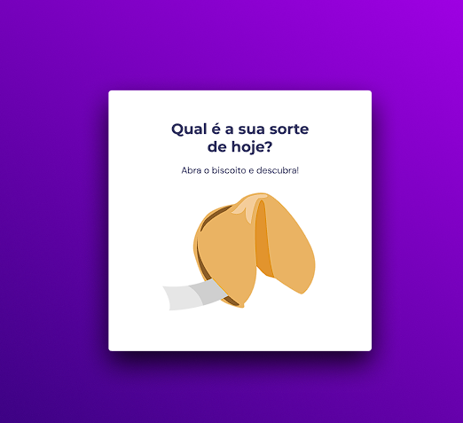

# 💻 Sobre o desafio

Figma do projeto -> https://www.figma.com/file/U37UfS7WfZZSiW36czVIFT/Biscoito-da-Sorte-(Community)?type=design&node-id=0-1&mode=design&t=7iKclOqaETbUkNkI-0

Neste desafio você deverá criar um jogo chamado Biscoito da Sorte, no qual o usuário, **a partir de um clique ou enter**, abre um biscoito com a sua sorte do dia. Você aplicará o que aprendeu sobre vários temas, entre eles:

- Estrutura de dados HTML
- Animações com CSS
- Funções no Javascript
- Manipulação da DOM
- Biblioteca JS Math()
- Funções *callback*
- Arrays

  

